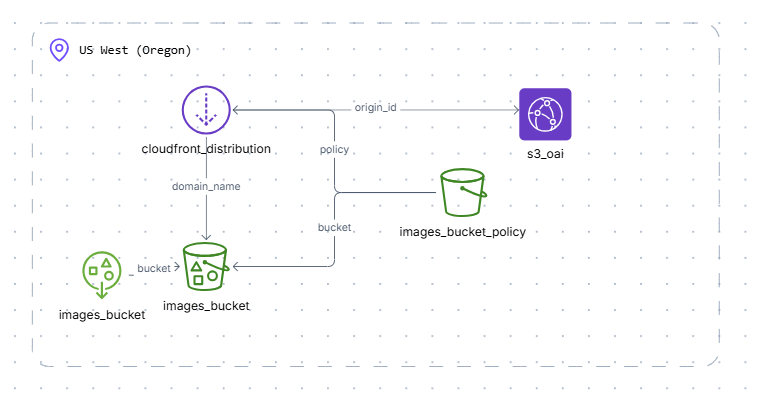

# Terraform Static Website Setup

This project sets up a static website hosted on Amazon S3 with a CloudFront CDN for improved performance and security. The website will list images stored in the S3 bucket.

## Project Structure

- `main.tf`: Main configuration file for Terraform, defining resources.
- `variables.tf`: Input variables for customization (e.g., bucket name, region).
- `outputs.tf`: Output values displayed after resource creation (e.g., S3 bucket URL, CloudFront distribution URL).
- `provider.tf`: AWS provider configuration, including region and credentials.
- `s3/bucket.tf`: S3 bucket resource definition, including website hosting configuration.
- `s3/policy.tf`: Bucket policy defining permissions for public access.
- `cloudfront/distribution.tf`: CloudFront distribution resource definition.
- `cloudfront/origin_access_identity.tf`: CloudFront origin access identity for secure S3 access.


## Architecture Diagram



## Setup Instructions

1. **Install Terraform**: Ensure you have Terraform installed on your machine. You can download it from the [Terraform website](https://www.terraform.io/downloads.html).

2. **Configure AWS Credentials**: Set up your AWS credentials. You can do this by configuring the AWS CLI or by setting environment variables.

3. **Customize Variables**: Edit the `variables.tf` file to customize the bucket name and region as needed.

4. **Initialize Terraform**: Navigate to the project directory and run the following command to initialize Terraform:
   ```
   terraform init
   ```

5. **Plan the Deployment**: Run the following command to see what resources will be created:
   ```
   terraform plan
   ```

6. **Apply the Configuration**: Deploy the resources by running:
   ```
   terraform apply
   ```

7. **Access the Website**: After the deployment is complete, you can access your static website using the CloudFront distribution URL provided in the output.

## Notes

- Ensure that your images are uploaded to the S3 bucket to be listed on the website.
- You can modify the S3 bucket policy in `s3/policy.tf` if you need to adjust access permissions.

For further details, refer to the individual `.tf` files in the project.